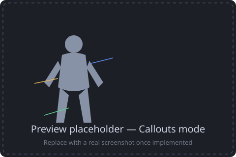
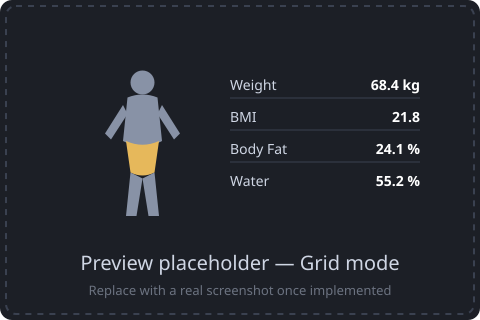
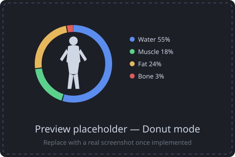

# OpenScale Card

A [Home Assistant](https://www.home-assistant.io/) Lovelace card that visualizes body composition data published by [openScale](https://github.com/oliexdev/openScale) via openScale-sync (MQTT) as a schematic body silhouette — weight, BMI, body fat, water, muscle mass, bone mass and more, at a glance.

## Status

🚧 Work in progress, but functional: all three display modes are implemented. The screenshots below are still placeholders — replace them with real captures once you've got the card running.

## Preview

| Callouts mode | Grid mode | Donut mode |
| :---: | :---: | :---: |
|  |  |  |

The silhouette is a simple, stylized outline (not anatomically precise) — openScale-sync's measurements are whole-body, not per-limb, so nothing in `callouts` mode implies a value belongs to a specific body part; the lines are purely a layout device.

## Requirements

- Home Assistant sensor entities created via openScale-sync's MQTT discovery. openScale-sync only publishes four raw measurements — **weight, body fat %, muscle %, total body water %** — everything else the card shows (BMI, lean body mass, fat/muscle/water mass in kg, BMR, TDEE) is derived from those four, see [Configuration](#configuration).

## Installation

### HACS (custom repository)

1. In Home Assistant, open **HACS → Frontend**.
2. Open the three-dot menu → **Custom repositories**.
3. Add this repository's URL with category **Lovelace**.
4. Install **OpenScale Card**, then add it as a dashboard resource if HACS doesn't do so automatically.

### Manual

Download `openscale-card.js` from this repository and register it as a Lovelace resource (Settings → Dashboards → Resources).

## Visual editor

The card has a visual configuration UI: add it via the dashboard's card picker (or edit an existing card) and use **Edit** instead of switching to YAML. It's split into three sections — general settings, entity pickers for the four raw openScale-sync sensors (plus optional bone mass/visceral fat/waist/hip if you have them from elsewhere), and on/off toggles for the computed metrics (BMI, lean body mass, fat/muscle/water mass in kg, BMR, TDEE). YAML mode works exactly the same, see below.

## Configuration

```yaml
type: custom:openscale-card
title: My Body Data
gender: female              # male | female — used for the silhouette
display_mode: grid          # callouts | grid | donut

height_cm: 170               # only needed to derive BMI
activity_level: moderate     # sedentary | light | moderate | active | very_active — only needed to derive TDEE

metrics:
  # The four raw measurements openScale-sync actually publishes via MQTT:
  weight:
    entity: sensor.openscale_weight
  body_fat:
    entity: sensor.openscale_body_fat
  muscle_mass:
    entity: sensor.openscale_muscle_mass
  water:
    entity: sensor.openscale_water

  # Derived metrics — omit "entity", an empty {} enables them:
  bmi: {}             # weight / (height_cm / 100)²
  lbm: {}              # weight × (1 − body_fat%)          — lean body mass
  fat_mass: {}         # weight × body_fat%                 (kg)
  muscle_mass_kg: {}   # weight × muscle_mass%              (kg)
  water_mass_kg: {}    # weight × water%                    (kg)
  bmr: {}              # Katch-McArdle formula from lbm
  tdee: {}             # bmr × activity_level factor
```

Every entry under `metrics` is optional — metrics without an entry are simply left out. A metric with `entity` set uses that entity's state; a metric listed with an empty `{}` is instead computed from the other configured metrics (and `height_cm` / `activity_level` where needed) — if the values it needs aren't available, the row is just omitted (this includes an `entity` whose state is currently `unavailable`/`unknown`). `bone_mass`, `visceral_fat`, `waist` and `hip` are supported too, but openScale-sync doesn't publish them, so they only work if sourced from elsewhere.

### Display modes

- **`grid`** — a small silhouette next to a plain value list. Works with any combination of metrics.
- **`callouts`** — a larger silhouette with pointer lines to the values, alternating left/right. Works with any combination of metrics.
- **`donut`** — a 100% ring around the silhouette showing the body-composition breakdown (water / fat / other lean mass, plus bone if you have a `bone_mass` entity in `%` or `kg`). Requires `water` and `body_fat` to be configured; falls back to `grid` otherwise. Any other configured metrics (weight, BMI, BMR, TDEE, ...) are listed below the ring.

### Trend arrows

Every value shows a small ↑/↓/→ arrow once the card has seen at least two different readings for it, comparing the current value to the previous one. This comparison only lives in the browser tab's memory — it resets when the card is re-added, the dashboard is reloaded, or Home Assistant restarts, so the very first render after any of those never shows an arrow yet.

## Development

```bash
npm install
npm run build   # bundles src/ into openscale-card.js
npm test        # runs the unit tests
```

## License

MIT — see [LICENSE](LICENSE).
